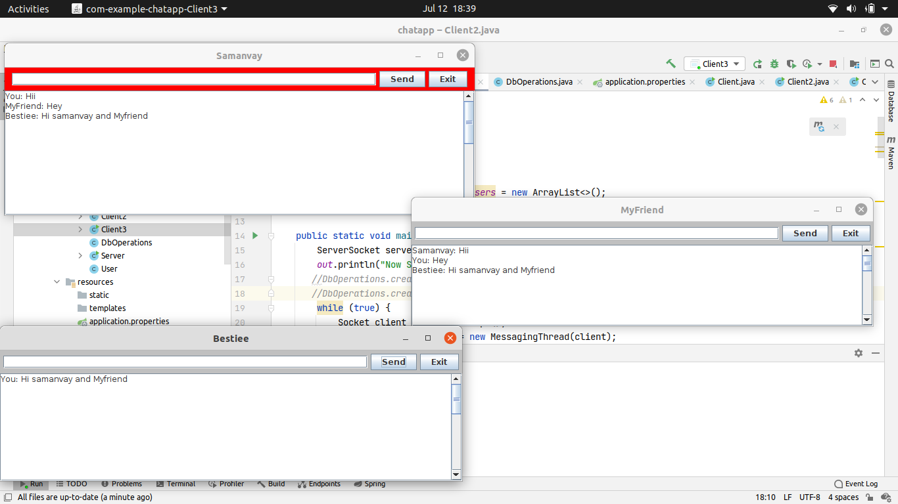

# chatapp
A chatting web application were threads are used to communicate between multiple clients and server .

# In this preview , three clients chatting through a single server.
                                                           

